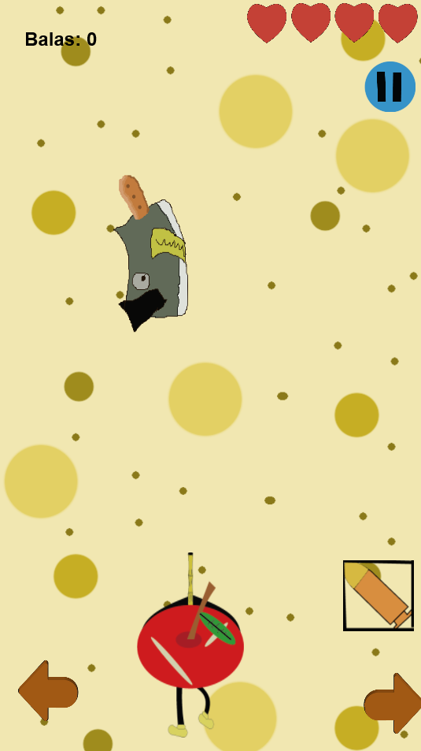
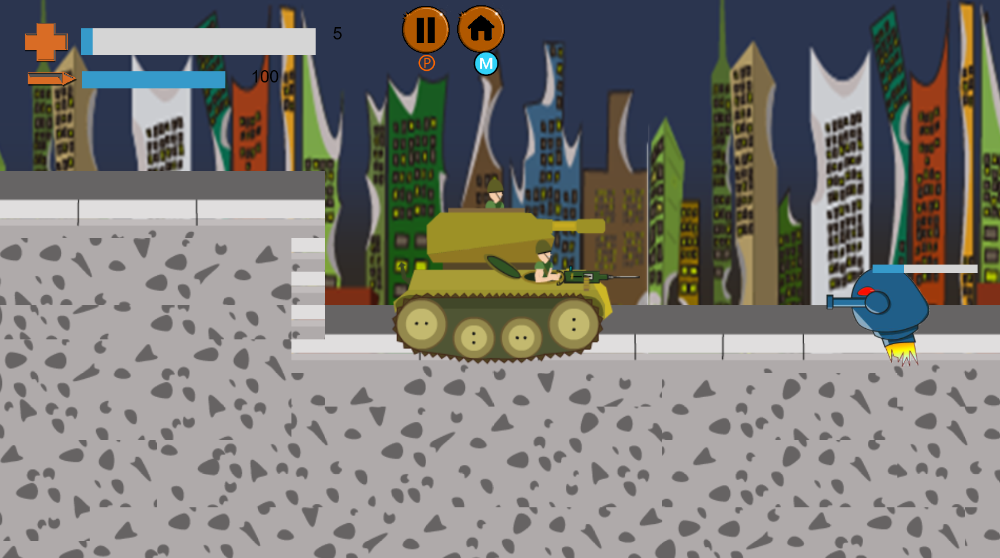

## Meu Portifólio

João Paulo O. da Costa, 20 anos

Aluno de desenvolvimento de jogos

Game designer
### Sobre mim

- Sou estudante de progração de jogos atualmente e sou do tipo que aprende com os erros e não torno a repeti-los, me dou bem com design e level design e tambem programo.

# Contatos

1. Facebook:[Clique aqui](https://www.facebook.com/joaopaulo.coconauta)
2. Email:[Gmail](joaopaulojhon82@gmail.com)

## Jogos

**Jogo 1** : The game of Fruits



- <a href="https://ciceroc.github.io/Game%20fruts/" target="_blank">O link para o jogo</a>


**Jogo 2** : The Day Future




- O link para o jogo: [Clique aqui](https://wesleybilly27.github.io/TFD/)

### Artes


4 - Adicionar um link que seja img "Url que seja arquivo".

]


### Markdown

Markdown is a lightweight and easy-to-use syntax for styling your writing. It includes conventions for

```markdown
Syntax highlighted code block

# Header 1
## Header 2
### Header 3

- Bulleted
- List

1. Numbered
2. List

**Bold** and _Italic_ and `Code` text

[Link](url) and 
```

For more details see [GitHub Flavored Markdown](https://guides.github.com/features/mastering-markdown/).

### Jekyll Themes

Your Pages site will use the layout and styles from the Jekyll theme you have selected in your [repository settings](https://github.com/JzpauloOliveira/JzpauloOliveira.github.io/settings). The name of this theme is saved in the Jekyll `_config.yml` configuration file.

### Support or Contact

Having trouble with Pages? Check out our [documentation](https://help.github.com/categories/github-pages-basics/) or [contact support](https://github.com/contact) and we’ll help you sort it out.
