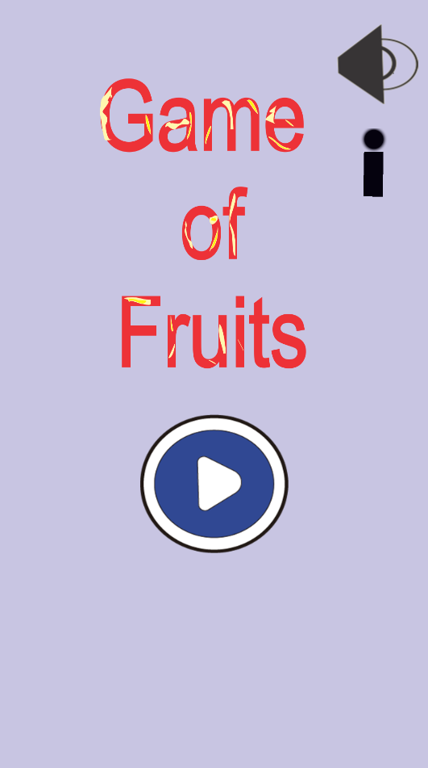
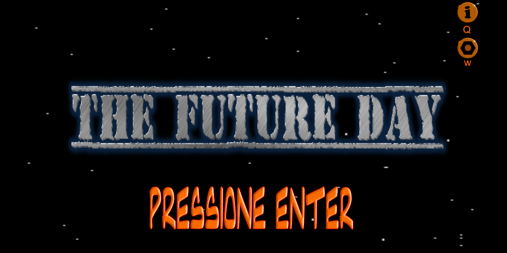
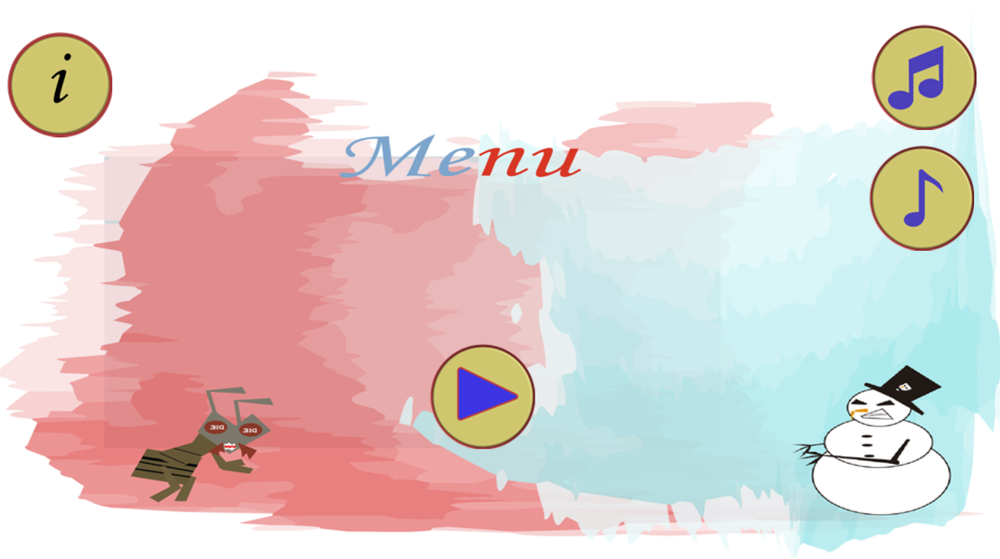
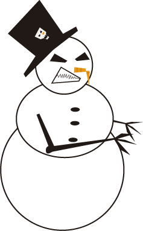

## Meu Portifólio

- João Paulo O. da Costa, 20 anos

- Aluno de desenvolvimento de jogos

- Estudante de Programação de jogos

### Sobre mim

- Sou estudante de progração de jogos atualmente e sou do tipo que aprende com os erros e não torno a repeti-los, me dou bem com design e level design e tambem programo.

# Contatos

1. Facebook:[Clique aqui](https://www.facebook.com/joaopaulo.coconauta)
2. Email:[Gmail](joaopaulojhon82@gmail.com)

## Jogos

**Jogo 1** : The game of Fruits

- <a href="https://ciceroc.github.io/Game%20fruts/" target="_blank">Clique aqui para ir ao jogo 1</a>

**Jogo 2** : The Future Day

- <a href="https://wesleybilly27.github.io/TFD/" target="_blank">Clique aqui para ir ao jogo 2</a>

**Jogo3** : Unstable Wether

- <a href="https://jzpaulooliveira.github.io/jogo3bim/" target="_blank">Clique aqui para ir ao jogo 2</a>
### Artes

